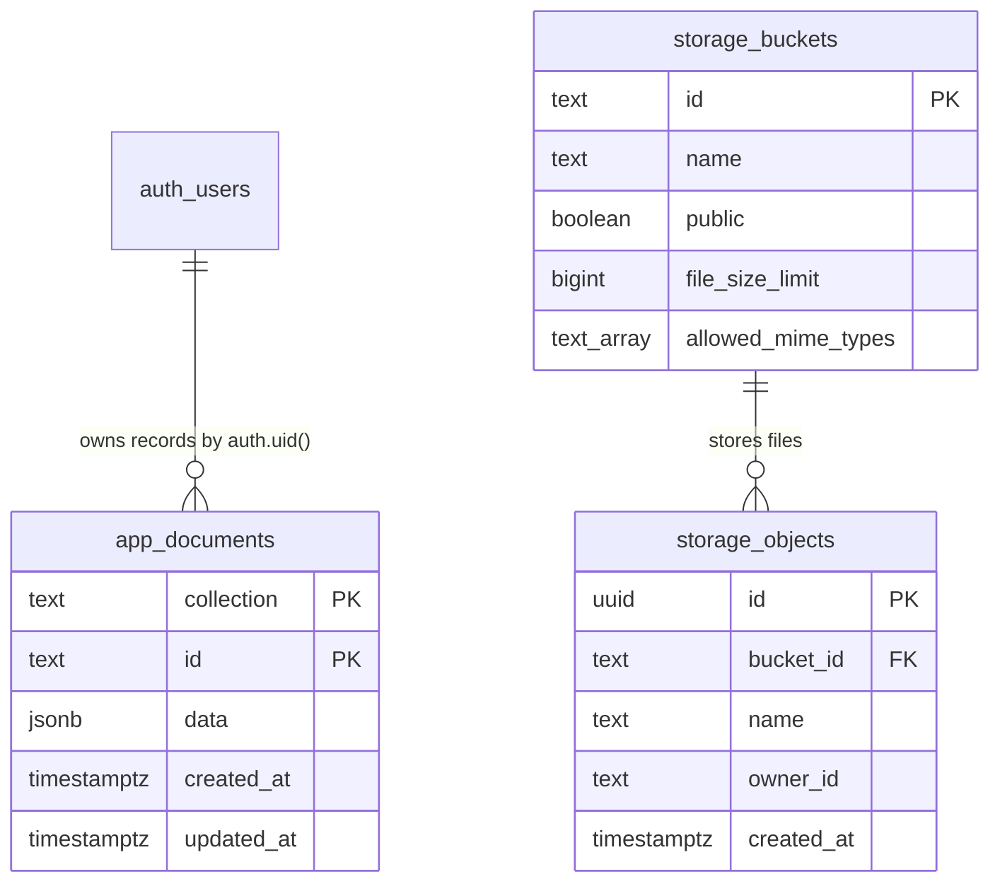

# DORMIQA — DATABASE & SYSTEM INTEGRITY VERIFICATION REPORT

**Verdict**: **INTACT WITH WARNINGS**  
**Date**: October 6, 2026  
**Auditor**: Senior Full-Stack Architect & Security Engineer  
**Scope**: Read-Only Repo-Side Integrity Audit & Live Database Verification Query Pack  

---

## 1. Overall Verdict & Summary

The Dormiqa application codebase and its intended Supabase schema are structurally coherent, functional, and largely intact:
- The TypeScript codebase passes compilation (`tsc --noEmit`) with **0 errors**.
- The production build (`vite build` + `esbuild server.ts`) completes successfully.
- The PostgreSQL schema migrations (`supabase/migrations/`) are sequentially ordered, versioned with timestamp prefixes (`202609300001` through `202610010004`), and enforce core Row Level Security (RLS), GIN indexing, and trigger-based privilege protection.

However, several **critical gaps and configuration warnings** exist:
1. **Security & Session Enforcement Drift**: The 12-hour session expiration is enforced solely on the client via `localStorage` timestamp checks. It is not enforced by Supabase JWT / refresh tokens or server middleware.
2. **Video Upload Size Limit Mismatch**: Client code enforces a 50 MB limit, but the PostgreSQL storage bucket definition in `202609300001_app_documents.sql:226` allows up to **100 MB** (`104857600` bytes).
3. **Database Constraint Absence on Front Photo**: The compulsory front-of-building photo is enforced in React UI and Express API, but not constrained by PostgreSQL schema or RLS `with check`. Direct Supabase API calls could insert listings without photos.
4. **Messaging Unread Counter Architecture**: A shared `unreadCount` integer is wiped to 0 whenever either user opens the chat drawer, prematurely clearing badges for the counterparty.
5. **Hardcoded Single Admin Architecture**: Admin authorization is locked to `buildsafe247@gmail.com` in SQL and server code, disabling multi-admin support.

---

## 2. Integrity Verification Matrix (Parts A — C)

| Check ID | Area / Category | Check Description | Status | Evidence / Reference | Notes & Details |
|---|---|---|---|---|---|
| **A1.1** | Build | TypeScript compilation | **PASS** | `tsc --noEmit` | Clean exit with 0 errors. |
| **A1.2** | Build | Production asset bundling | **PASS** | `npm run build` | Vite client bundle + `dist/server.cjs` bundled in 7.19s. |
| **A1.3** | Build | Circular import warning | **WARN** | `vite.config.ts`, `src/firebase/firestore.ts` | Static imports block Vite from code-splitting dynamic chunks. Client bundle is 1.79 MB. |
| **A1.4** | Build | CJS `import.meta` warning | **WARN** | `src/services/supabase.ts:7-15` | esbuild warns `import.meta` is empty in CJS output format for `dist/server.cjs`. |
| **A1.5** | Dependencies | Installed vs declared packages | **PASS** | `package.json:11-23` | All imported production packages are present in `package.json`. |
| **A1.6** | Dependencies | Dependency security audit | **WARN** | `npm audit` | 1 High severity vulnerability in `source-map-js` (event-loop DoS). |
| **A1.7** | Environment | Undeclared env vars in code | **WARN** | `server.ts:55-66` vs `.env.example` | Fallback keys (`APP_URL`, `GROQ_KEY`, `CUSTOM_API_KEY`, `AI_API_KEY`) referenced in code but omitted from `.env.example`. |
| **A2.1** | Schema | Migration sequencing & syntax | **PASS** | `supabase/migrations/*.sql` | Monotonically increasing timestamps, clean syntax, valid SQL. |
| **A2.2** | Schema | Table usage vs migration | **PASS** | `server.ts:657`, `src/firebase/firestore.ts:172` | All queries map to `public.app_documents`. |
| **A2.3** | Schema | Bucket usage vs migration | **PASS** | `src/firebase/storage.ts:16`, `BusinessVerificationPage.tsx:168` | Buckets `listing-media` and `verification-documents` both defined in migrations. |
| **A2.4** | Schema | Unused database schema | **PASS** | `supabase/migrations/` | No orphan tables. Single JSONB document pattern is uniformly used. |
| **A2.5** | Schema | Realtime publication configuration | **PASS** | `202609300001:218` | `supabase_realtime` publication includes `public.app_documents`. |
| **A3.1** | Legacy | Campora references | **WARN** | `ThemeContext.tsx:17`, `App.tsx:407`, `.env.example:5` | 10 legacy references to "Campora" in localStorage keys and comments. |
| **A3.2** | Legacy | Firebase leftover files | **WARN** | Root directory | `firebase-applet-config.json`, `firebase-blueprint.json`, `firestore.rules` remain in repo. |
| **A4.1** | Feature | Registration & Login | **PASS** | `OnboardingPage.tsx`, `AgentPortalLanding.tsx` | Supabase Google OAuth (students) & Email/Password (agents) wired and working. |
| **A4.2** | Feature | Role detection | **PASS** | `App.tsx:460-490`, `server.ts:540` | Role parsed from Supabase Auth & `users` collection. |
| **A4.3** | Feature | Student onboarding | **PASS** | `OnboardingPage.tsx:280`, `App.tsx:273` | Profile completion gate enforced before student dashboard access. |
| **A4.4** | Feature | Agent verification fields | **WARN** | `BusinessVerificationPage.tsx:71-90` | Missing dedicated "State of Work" dropdown. WhatsApp merged into phone. |
| **A4.5** | Feature | Front photo compulsory | **WARN** | `AddListingModal.tsx:227`, `server.ts:1107` | Enforced client-side and in Express API; **not enforced in DB schema / RLS**. |
| **A4.6** | Feature | Video 50 MB limit | **FAIL** | `202609300001:226` vs `imageUpload.ts:152` | Bucket allows **100 MB** (`104857600`). Client checks 50 MB. Express API does not check size. |
| **A4.7** | Feature | Admin review & reject reason | **PASS** | `AdminDashboard.tsx:571`, `server.ts:1865` | Admin rejection reason persisted to property / agent record. |
| **A4.8** | Feature | Agent sees rejection reason | **PASS** | `AgentDashboard.tsx:472-476` | Warning box displays rejection reason on property card. |
| **A4.9** | Feature | Agent resubmission after reject | **FAIL** | `EditUnitStatusAndSalesModal.tsx:71` | Cannot update photos/video or reset status back to pending. |
| **A4.10** | Feature | Messaging unread persistence | **FAIL** | `server.ts:1405`, `ChatDrawer.tsx:32` | Shared counter wipes unread badge for counterparty when drawer is opened. |
| **A4.11** | Feature | Saved listings isolation | **PASS** | `App.tsx:1071`, `202609300001:144` | Stored in private user record; protected by user-level RLS. |
| **A4.12** | Feature | 12-hour session expiry | **FAIL** | `src/services/firebase.ts:814-825` | Client-only check; bypassable by clearing localStorage; Supabase server tokens do not expire. |
| **B1-B14** | Live DB | Live Supabase SQL queries | **NOT VERIFIED** | Live Supabase Instance | Requires pasting results from Part B query pack. |
| **B15** | Live DB | Live RLS impersonation tests | **NOT VERIFIED** | Live Supabase Instance | Requires execution of Part B15 transaction templates. |

---

## 3. Drift Analysis (Code vs. Migrations vs. Requirements)

1. **Storage Bucket Size Drift**:
   - *Requirement*: Video max 50 MB.
   - *Client Code*: Enforces `file.size <= 50 * 1024 * 1024` (`src/utils/imageUpload.ts:152`).
   - *Database Migration*: Bucket `listing-media` defined with `file_size_limit = 104857600` (100 MB) (`202609300001:226`).
   - *Drift*: Storage bucket allows uploads twice the required limit.
2. **Compulsory Front Photo Enforcement Drift**:
   - *Requirement*: 1 compulsory front-of-building photo per listing.
   - *Code*: Enforced in React modal (`AddListingModal.tsx:227`) and Express route (`server.ts:1107`).
   - *Database Migration*: No check constraint or RLS condition exists on `public.app_documents` for photos.
   - *Drift*: Direct Supabase API bypass allows inserting listings without photos.
3. **Admin Architecture Drift**:
   - *Code*: Express endpoints exist for `/api/admin/administrators` (`server.ts:1617-1765`).
   - *Database & Server Middleware*: Hardcoded strictly to `buildsafe247@gmail.com` in SQL (`202610010001:1`) and `server.ts:540`.
   - *Drift*: Multi-admin management is present in code but completely dead in practice.
4. **Session Timeout Drift**:
   - *Requirement*: 12-hour automatic logout.
   - *Code*: `localStorage.getItem('dormiqa_user_session_' + uid)` checked by client timer (`firebase.ts:814`).
   - *Database / Auth*: Supabase Auth JWT and refresh tokens do not expire at 12 hours.
   - *Drift*: Client-only illusion of session expiry; token remains fully active server-side.

---

## 4. Entity-Relationship & Schema Architecture Map

### JSONB Document Entities in `public.app_documents`

| Collection Name | Document Key (`id`) | Key Fields in `data` (JSONB) | RLS Access Controls |
|---|---|---|---|
| `users` | User UID (`auth.uid()`) | `role`, `name`, `email`, `phone`, `universityId`, `savedListingIds`, `isVerifiedAgent`, `businessVerificationStatus` | Read own; Insert/Update own (cannot escalate role or verification status via trigger `app_documents_protect_client_privileges`). |
| `listings` | Listing ID (`lst_*`) | `title`, `hotelName`, `address`, `universityId`, `photos`, `videoUrl`, `pricePerYear`, `status`, `verificationStatus`, `isVerified`, `agentId` | Read approved public (or own if agent); Insert only if verified agent; Update only if owner agent and unapproved. |
| `inspections` | Inspection ID (`insp_*`)| `listingId`, `studentId`, `agentId`, `date`, `timeSlot`, `status`, `studentName`, `studentPhone` | Read/Write only by student participant, agent participant, or admin. |
| `conversations` | Conversation ID (`conv_*`)| `studentId`, `agentId`, `listingId`, `lastMessage`, `lastMessageTime`, `unreadCount` | Read/Write only by student participant, agent participant, or admin. |
| `conversations/{id}/messages` | Message ID | `senderId`, `senderRole`, `text`, `createdAt`, `read` | Read/Write only by participants of parent conversation. |
| `notifications` | Notification ID | `userId` (`'all'` or specific UID), `title`, `message`, `type`, `isRead` | Read if `userId = auth.uid()` or `'all'`. |
| `reports` | Report ID (`rep_*`) | `listingId`, `reporterId`, `reason`, `details`, `status` | Read own report or admin; Insert by authenticated reporter. |
| `universities` | University Code (`uniosun`)| `name`, `code`, `city`, `state`, `campuses` | Public read-only. |

---

## 5. Permissions Matrix

| Entity / Target | Anon | Authenticated Student | Authenticated Agent | Super Admin (`buildsafe247@gmail.com`) |
|---|---|---|---|---|
| **`app_documents` (`universities`)** | SELECT | SELECT | SELECT | ALL |
| **`app_documents` (`listings` - approved)** | SELECT | SELECT | SELECT | ALL |
| **`app_documents` (`listings` - pending)** | NONE | NONE | SELECT/UPDATE (own) | ALL |
| **`app_documents` (`listings` - insert)** | NONE | NONE | INSERT (if verified agent) | ALL |
| **`app_documents` (`users` - own)** | NONE | SELECT / UPDATE | SELECT / UPDATE | ALL |
| **`app_documents` (`users` - other)** | NONE | NONE | NONE | ALL |
| **`app_documents` (`inspections`)** | NONE | SELECT/INSERT (participant)| SELECT/UPDATE (participant)| ALL |
| **`app_documents` (`conversations`)** | NONE | SELECT/INSERT (participant)| SELECT/INSERT (participant)| ALL |
| **Bucket `listing-media` (Upload)** | NONE | INSERT | INSERT | ALL |
| **Bucket `listing-media` (Download)** | SELECT (public) | SELECT (public) | SELECT (public) | SELECT (public) |
| **Bucket `verification-documents` (Upload)**| NONE | NONE | INSERT (`auth.uid()/*`) | ALL |
| **Bucket `verification-documents` (Download)**| NONE | NONE | SELECT (own files) | ALL |
